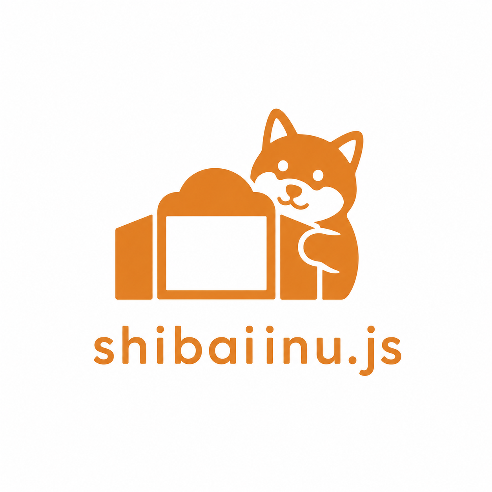

<p align="center">
  
</p>

# Shibaiinu - ノベルゲームエンジン

ブラウザで動作するシンプルなノベルゲームエンジンです。

## 特徴

- 複数シナリオ対応（タイトル画面で選択）
- 複数キャラクター同時表示（左・中央・右）
- 背景画像の表示
- BGM・効果音の再生（音量調整可能）
- 選択肢による分岐（キーボード操作対応）
- フラグ管理による条件分岐
- セーブ/ロード機能
- テキスト装飾タグ（色、太字、震え、改行）
- コードブロック表示（コピーボタン付き）
- タイプライター効果
- メッセージ履歴
- シナリオ別アセットパス
- Electronでデスクトップアプリ化可能

## 起動方法

### ブラウザで開発

```bash
npx serve .
# または
python3 -m http.server 8000
```

- ゲーム: http://localhost:8000
- シナリオビューワー: http://localhost:8000/viewer.html

### Electronで実行

```bash
npm install    # 初回のみ
npm start      # 開発用（ウィンドウで起動）
```

---

## 配布用ビルド（Electron）

アセットを保護したデスクトップアプリとして配布できます。

### ビルドコマンド

```bash
npm install          # 初回のみ

npm run build:mac    # Mac用 (.dmg, .zip)
npm run build:win    # Windows用 (.exe)
npm run build:linux  # Linux用 (.AppImage, .deb)
```

### 出力先

```
dist/
├── Shibaiinu.js-1.0.0-<arch>.dmg       # Mac配布用 (<arch> は arm64 / x64)
├── Shibaiinu.js-1.0.0-<arch>-mac.zip
└── mac-<arch>/
    └── Shibaiinu.js.app/               # アプリ本体
```

### アセットの保護

- `asar: true` 設定により、全ファイルが `app.asar` にパッケージ化
- アセット（画像・音声）がフォルダとして丸見えにならない
- 完全な暗号化ではないが、カジュアルなアクセスを防止

### アプリ情報のカスタマイズ

`package.json` の `build` セクションを編集：

```json
{
  "build": {
    "appId": "com.yourname.yourgame",
    "productName": "YourGameName",
    "mac": {
      "icon": "build/icon.png"
    },
    "win": {
      "icon": "build/icon.png"
    },
    "linux": {
      "icon": "build/icon.png"
    }
  }
}
```

`electron-builder` は単一 PNG (512×512 以上) からプラットフォーム別アイコンを自動生成します。

### macOS のコード署名・公証（任意）

macOS で配布する場合、Apple のコード署名と公証（Notarization）を行うと受け取った側で警告が一切出なくなります。OSS でも各ビルダーが自分の Apple Developer 証明書を使ってビルドできるよう、フレームワーク側は証明書を **Keychain から自動検出する** 設定になっています。

| ビルダーの状態 | ビルド結果 | 受け取った側の体験 |
|---|---|---|
| 何も設定しない（既定） | ad-hoc 署名のみ | 「開発元を確認できません」警告 → 下記の手順で起動可 |
| Developer ID 証明書あり | 署名済み（公証なし） | 警告軽減（環境によってはまだ出る） |
| 証明書 + 公証 env 設定 | 署名 + 公証済み | 警告なし、ダブルクリックで起動 |

#### 自分の証明書で署名する

1. [Apple Developer Program](https://developer.apple.com/programs/)（$99/年）に加入
2. developer.apple.com → Certificates で **「Developer ID Application」** 証明書を発行
3. ダウンロードした `.cer` をダブルクリック → **Keychain Access に自動登録**
4. 通常通り `npm run build:mac` を実行

これだけで `electron-builder` が Keychain を検索して証明書を見つけ、自動で署名します（`package.json` の編集は不要）。

#### 公証（Notarization）まで通す

警告を完全に消すには Apple サーバーへの公証も必要です。ビルド時に以下の環境変数を設定：

```bash
export APPLE_ID="your.apple.id@example.com"
export APPLE_APP_SPECIFIC_PASSWORD="xxxx-xxxx-xxxx-xxxx"
export APPLE_TEAM_ID="ABCDE12345"

npm run build:mac
```

- `APPLE_APP_SPECIFIC_PASSWORD` は [appleid.apple.com](https://appleid.apple.com/) → サインインとセキュリティ → アプリ用パスワード で発行
- `APPLE_TEAM_ID` は developer.apple.com → Membership で確認

公証が成功すると `.app` に "stapled" な公証チケットが埋め込まれ、オフライン環境でも警告なしで起動できます。

#### 何も設定しない場合（ad-hoc 署名のみ）

`electron/afterPack.js` が自動で ad-hoc 署名を当てるので、未署名の「壊れているため開けません」エラーは回避できます。受け取った側は次の手順で起動できます。

### macOS での初回起動について（署名なし配布の場合）

ad-hoc 署名のみ（Developer ID なし）で配布された `.app` を初回起動するときは、以下のいずれかが必要です。

**方法1: 右クリックして開く**（macOS Sonoma 以前）

1. `Shibaiinu.js.app` を **右クリック（または control + クリック）**
2. メニューから「開く」を選択
3. 警告ダイアログの「開く」をクリック

**方法2: システム設定から許可**（macOS Sequoia 以降の推奨手順）

1. 一度普通にダブルクリックして警告ダイアログが出るのを待つ
2. 「システム設定 → プライバシーとセキュリティ」を開く
3. 一番下までスクロールして **「このまま開く」** をクリック
4. 認証（Touch ID または管理者パスワード）

**方法3: ターミナルで quarantine 属性を削除**（最も確実）

```bash
xattr -dr com.apple.quarantine /Applications/Shibaiinu.js.app
```

一度許可すれば次回以降は普通にダブルクリックで起動できます。

---

## ディレクトリ構成

```
novel/
├── index.html              # ゲーム本体
├── viewer.html             # シナリオビューワー
├── usage.html              # 使い方ドキュメント
├── package.json            # npm/Electron設定
├── LICENSE                 # MIT
├── build/
│   └── icon.png            # アプリアイコン (electron-builder用)
├── electron/
│   ├── main.js             # Electronメインプロセス
│   └── afterPack.js        # macOSのad-hoc署名フック
└── shibaiinu/              # エンジン本体（このフォルダごとコピーで使用可能）
    ├── engine.js           # ShibaiinuEngineクラス（HTML/CSS動的生成）
    ├── core/               # 内部モジュール
    │   ├── scenario.js     # シナリオ進行ロジック
    │   ├── audio.js        # オーディオコントローラー
    │   ├── background.js   # 背景画像コントローラー
    │   ├── events/         # イベントクラス (message/selection/input/wait/base)
    │   └── util/           # textTags, animation などのユーティリティ
    ├── scenario/
    │   └── sampleGame.js   # サンプルシナリオ
    ├── scripts/
    │   ├── setup-scenario.sh   # シナリオ雛形を追加
    │   └── delete-scenario.sh  # シナリオ削除
    └── assets/             # アセット
        ├── system/         # フレームワーク同梱（システム SE / サンプルゲーム素材）
        │   ├── audio/
        │   └── sample_game/
        │       ├── audio/
        │       └── images/
        │           ├── backgrounds/
        │           └── person/
        └── users/          # ユーザー追加シナリオの素材（setup-scenario.sh が生成）
```

---

## 使い方

シナリオの書き方、イベント定義、テキスト装飾などの詳細は **[使い方ドキュメント](https://yuki-sobue.github.io/shibaiinu.js/usage.html)** を参照してください。

`shibaiinu/scripts/setup-scenario.sh` で新規シナリオの雛形（イベントファイルとアセットディレクトリ）を一括生成できます。詳細は usage.html の「シナリオ管理スクリプト」セクションを参照してください。

---

## ライセンス

[MIT License](LICENSE) — Copyright (c) 2026 Yuki Sobue
